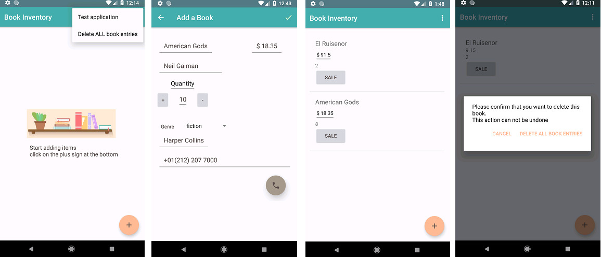

# Inventory

<h3>Book Store Inventory App</h3>
An application that allows to keep inventory of items as well as calling supplier to order more items.

<strong>Classes, Interfaces and Objects used:</strong>
<ul>
<li>SQLite</li>
<li>DBHelper</li>
<li>Cursor Adapter</li>
<li>Architecture components</li>
<li>Material Design</li>
<li>Third-party libraries: <a href="https://github.com/santalu/mask-edittext" target+"_blank">Mask EditText</a></li>
</ul>

Preview:

